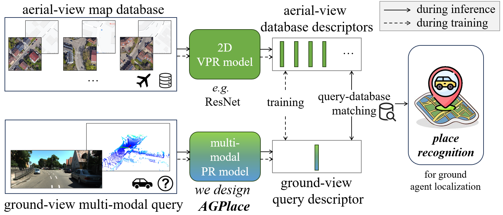

# AGPlace
(CVPR 2025) Multi-Modal Aerial-Ground Cross-View Place Recognition with Neural ODEs




## Requirements

- Platform
```
Ubuntu 22.04
python 3.10
CUDA 11.8
```

- PyTorch
```
pip install torch==2.0.0 torchvision==0.15.1 torchaudio==2.0.1 --index-url https://download.pytorch.org/whl/cu118

```

- MinkowskiEngine
```
pip install numpy==1.22.4
pip install setuptools==59.8.0
conda install openblas-devel -c anaconda -y
pip install pip==22.3.1
pip install -U git+https://github.com/NVIDIA/MinkowskiEngine -v --no-deps --install-option="--blas_include_dirs=${CONDA_PREFIX}/include" --install-option="--blas=openblas"
```

- Others
```
pip install laspy pytest addict pytorch-metric-learning==0.9.97 yapf==0.40.1 bitarray h5py transforms3d open3d
pip install tqdm setuptools==59.5.0 einops
pip install bagpy utm pptk
pip install pyexr pyntcloud
pip install torchdiffeq
pip install torchsde
pip install torchcde
pip install git+https://github.com/openai/CLIP.git

pip install numpy==1.25.0
pip install faiss-cpu

pip install transformers
pip install googledrivedownloader
pip install timm
pip install fast-pytorch-kmeans
pip install kornia opencv-python  
pip install spconv-cu118
pip install transformers timm
pip install nuscenes-devkit utm
pip install tabulate

pip install huggingface-hub
pip install timm
pip install transformers
pip install albumentations
```

## Dataset
We have uploaded the datasets for KITTI-360-AG and nuScenes-AG onto Google Drive [(download_link)](https://drive.google.com/drive/folders/12uyfEa5Xng5FdVNrXqOPI-tRZcD3OKuZ?usp=sharing).
KITTI-360-AG is in `cmvpr.zip`, and nuScenes-AG is in `radar.zip`. 

All data has been processed and is ready. You just need to download and unzip them.

## Running
- Then you need change some configurations in `tools/options.py` to point to your KITTI-360-AG or nuScenes-AG path. E.g., `--dataroot` `--dataset`.

- Then you can start the code running. 
```
# nuscenes
python train.py --cuda 0  --dataset nuscenes  --camnames fl_f_fr_bl_b_br

# kitti360
python train.py --cuda 1  --dataset kitti360  --camnames 00
```

- The code is based on the DVGLB framework (https://github.com/gmberton/deep-visual-geo-localization-benchmark). You can find more information on it.


## License
The code follows [NTUitive Dual License](./NTUitive%20Dual%20License.rtf).