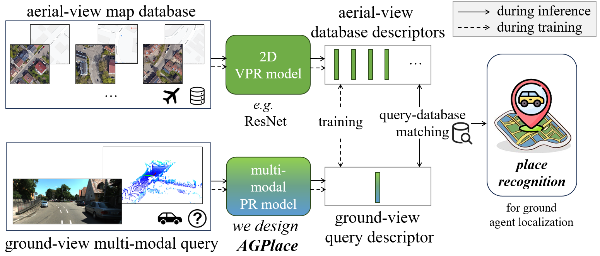

# AGPlace
(CVPR 2025) Multi-Modal Aerial-Ground Cross-View Place Recognition with Neural ODEs

The repo is keeping updating.

# Dataset
We have uploaded the datasets for KITTI-360-AG and nuScenes-AG onto Google Drive [(download_link)](https://drive.google.com/drive/folders/12uyfEa5Xng5FdVNrXqOPI-tRZcD3OKuZ?usp=sharing).
KITTI-360-AG is in `cmvpr.zip`, and nuScenes-AG is in `radar.zip`.
